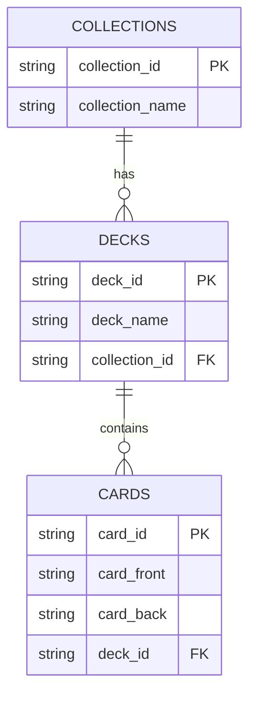

# Data Model

## Relational Model

**Entities:**

- Collection (1) → (N) Deck
- Deck (1) → (N) Card

**Tables:**

- `collections`
- `decks`
- `cards`

**Relationships:**

- `decks.collection_id` → `collections.id`
- `cards.deck_id` → `decks.id`

