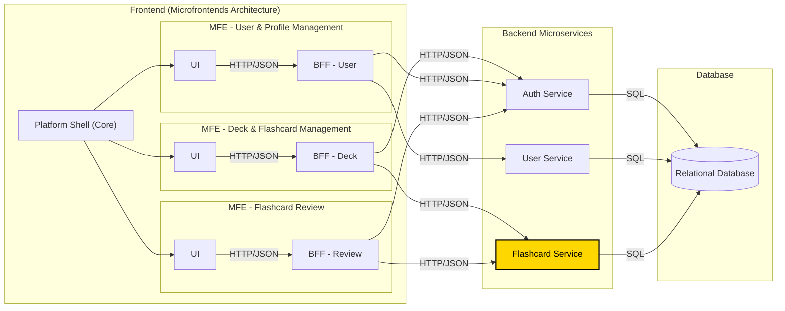

# General Project Architecture

**DISCLAIMER: This repository focuses EXCLUSIVELY on the 'Flashcard Service' (highlighted in yellow in the diagram below). The other components are part of the broader system context but are not within the scope of this specific project.**

This document describes the high-level architecture of the study platform, which utilizes a Microfrontend (MFE) architecture on the frontend and a Microservices architecture on the backend, coordinated through a Backend for Frontend (BFF) pattern within each MFE.

